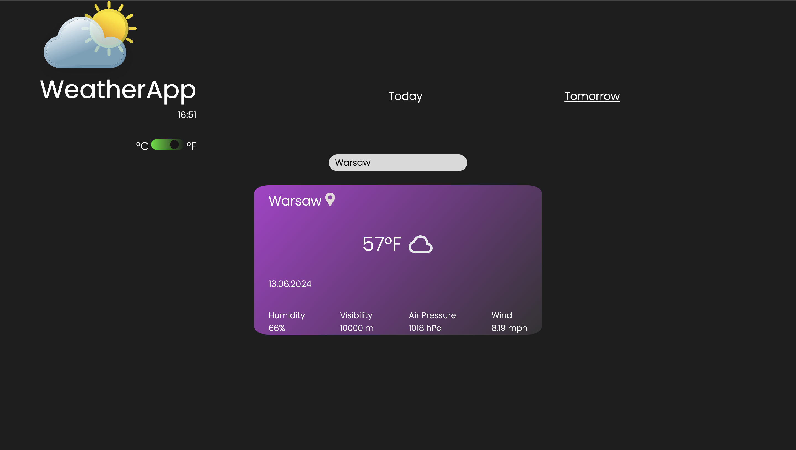

# Weather App.

## A few words about the project.

This is my first JavaScript project. I built this site from scratch using HTML, CSS and JavaScript.

I took my inspiration for the frontend from [Figma](https://www.figma.com/community/file/1150662589138316249/weatherme-website?searchSessionId=lxbxsy74-mjoije83mk) and made some adjustments.

The site is also **fully responsive**.

## Functionality.

You can search for any city to **check the weather for today and tomorrow**. You can also switch between **imperial and metric units!**

The icon which is shown next to the temperature depends on the weather situation.

## Have a look!

Landing page:

Search for today's weather:

- with metric units

- with imperial units

Search for tomorrow's weather:

- with metric units

- with imperial units

